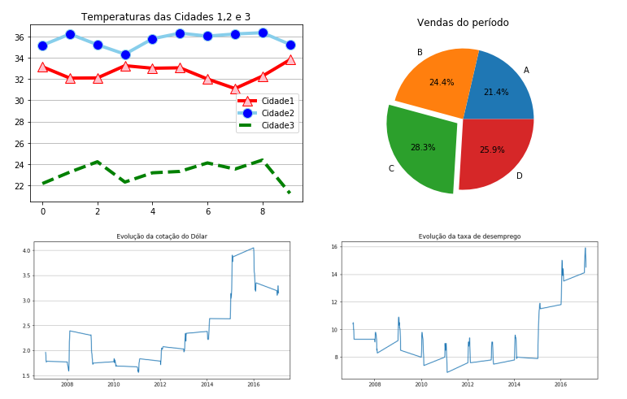
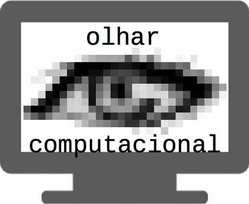
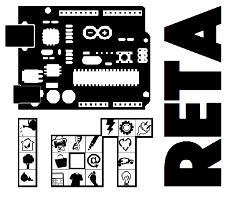

# O seu Hub de Datascience, Machine Learning e IA
[*Cleuton Sampaio*](https://github.com/cleuton)

Aqui, você encontrará materiais dos meus livros: 
- [**Datascience para programadores - Usando python**](https://github.com/cleuton/datascience/tree/master/book/) Editora Ciência Moderna
- [**Datascience para profissionais - Usando R**](https://github.com/cleuton/datascience/tree/master/book-R) Editora Ciência Moderna

## Cursos

Além de vídeos, cursos, exemplos e farto material para o seu aprendizado. Todo o meu curso gratuito de [**Introdução à datascience com R**](R-course/README.md) está disponível aqui

Outro curso interessante para você: [**Visualização de dados com python**](./datavisualization)

 

## Visão computacional

## IoT & Datascience

Artigos sobre visão computacional com Deep Learning!
- [**Reconhecimento facial** Com Raspberry PI e TensorFlow](http://www.obomprogramador.com/2018/02/tutorial-de-machine-learning-iot.html)
- [**Detecção de rostos e classificação para webcams**](http://www.obomprogramador.com/2018/09/deteccao-e-reconhecimento-facial-para.html)
- [**Tutorial de CNN para classificação de imagens**](https://github.com/cleuton/FaceGuard/tree/master/CNN)

## Datasets

Também separei um conjunto fantástico de [**datasets**](https://github.com/cleuton/datascience/tree/master/datasets) para você aprender datascience.

## Natural Language Processing

Tenho também alguns exemplos interessantes de [**NLP**](https://github.com/cleuton/datascience/tree/master/nlp): tagCloud e Análise de sentimentos, incluindo análise de *RSS feeds* e *Tweets*.

## Reconhecimento facial

Temos vários artigos e farto código sobre reconhecimento facial: 
1. [**Reconhecimento facial com Java, C++ usando HOG**](http://www.obomprogramador.com/2019/03/comparacao-de-rostos-com-java-e-c.html);
2. [**Reconhecimento facial com Tensorflow e CNN**](http://www.obomprogramador.com/2019/03/reconhecimento-e-classificacao-facial.html)

## Deep learning

Aqui também temos exemplos de *Deep Learning* com vários frameworks. Por exemplo, temos esse tutorial utilizando o **Keras**: [**Exemplo de deep learning com Keras**](./keras).

# SIGA-ME

Navegue, descubra e divulgue! Para me seguir, use os canais: 

- [**LinkedIn**](https://www.linkedin.com/in/cleutonsampaio/)
- [**O Bom Programador**](http://obomprogramador.com)
- [**Twitter**](https://twitter.com/cleutonsampaio)

Exceto quando explicitamente escrito, todos os materiais são licenciados sob 

[*Creative Commons - Atribuição  4.0 Internacional*](http://creativecommons.org/licenses/by/4.0/)

