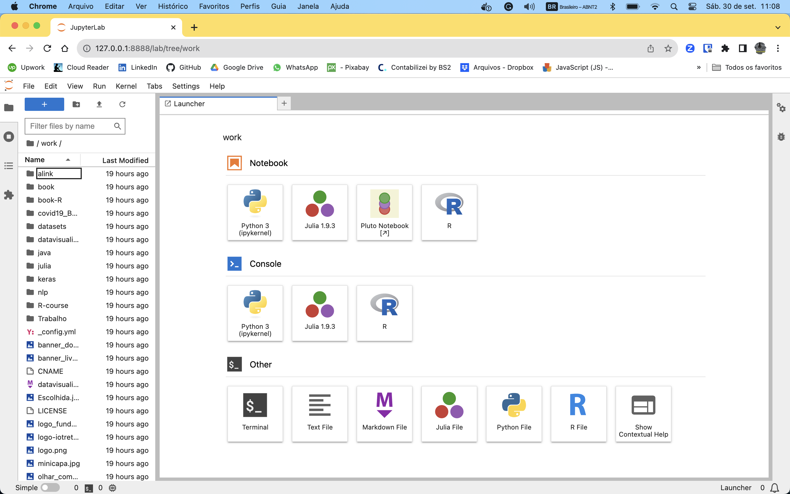
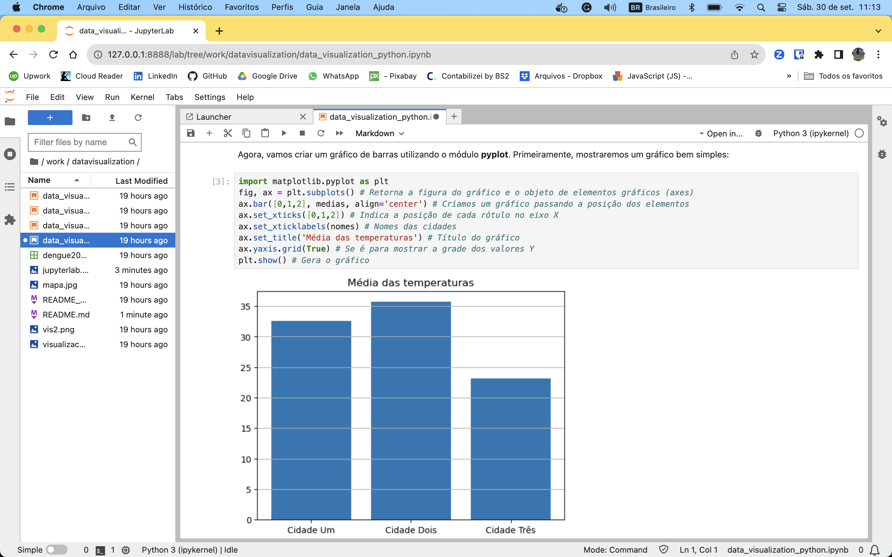

# O seu Hub de Datascience, Machine Learning e IA
[*Cleuton Sampaio*](https://github.com/cleuton)

[](https://www.lcm.com.br/site/#livros/busca?term=cleuton)

[**ENGLISH VERSION**](./README_english.md)

# Mini curso de visualização de dados com Python

Este mini curso ensinará a você como criar visualizações em Python para trabalhos de data Science, usando recursos simples. Cada lição abordará um tema. Veja só: 

## 1 - Turbo introdução aos gráficos

Nesta lição veremos a parte básica de geração de gráficos, com formatação e posicionamento dos gráficos mais comuns.


Veja [**AQUI**](./data_visualization_python.ipynb) O Notebook Jupyter dessa lição.

## 2 - Visualizações com mais de 2 dimensões

Nesta lição veremos como fornecer visualizações com mais de duas dimensões de dados.


Veja [**AQUI**](./data_visualization_python_2.ipynb) O Notebook Jupyter dessa lição.

## Setup do curso

Em vez de instalar tudo na sua máquina, que tal utilizar um **contêiner Docker**? Fica muito mais fácil de trabalhar, certo? Podemos subir um contêiner e compartilhar esta pasta (do projeto inteiro) com ele. 

**Para começar**: Clone o repositório. Isto criará uma pasta **datascience** em sua máquina. 
```
git clone https://github.com/cleuton/datascience.git
cd datascience
```

Agora, é só subir um contêiner com a imagem docker **"jupyter/datascience-notebook"**: 
```
docker run -it --rm -p 8888:8888 -v "${PWD}":/home/jovyan/work jupyter/datascience-notebook
```

Se você estiver utilizando **Macos** ou **MS Windows** terá que iniciar o ambiente **Docker** antes de subir um contêiner. 

Mantenha a janela do terminal aberta e copie o "token de acesso". Na verdade, ele já mostra a url completa para você acessar a partir do seu navegador local. Veja este exemplo: 
```
   To access the server, open this file in a browser:
        file:///home/jovyan/.local/share/jupyter/runtime/jpserver-7-open.html
    Or copy and paste one of these URLs:
        http://cae35227d5b2:8888/lab?token=878e818889d5bd68063f0ef07699cb9f61423b7d73584414
        http://127.0.0.1:8888/lab?token=878e818889d5bd68063f0ef07699cb9f61423b7d73584414
```

Abra seu navegador e cole a URL: 
```
http://localhost:8888/?token=878e818889d5bd68063f0ef07699cb9f61423b7d73584414
```

Pronto! Você estará na página do Jupyter Lab, com sua pasta compartilhada aparecendo ("work"): 


A partir dela, você pode abrir qualquer pasta ou notebook. Navegue para a pasta "datavisualization" e abra o notebook "data_visualization_python.ipynb": 



### A segunda lição 

Na segunda lição, utilizamos a API do **Google Maps** para obter o mapa estático do Estado do Rio de Janeiro. Desta forma, eu faço uma demonstração de "mapa de calor" georreferenciado. 

Para isso, você precisa ter uma conta **Google**, registrar um projeto na **Google Console** e criar uma **chave de API** para usar o **Google Maps**.

Este [**link**](https://developers.google.com/maps/documentation/maps-static/get-api-key) contém tudo o que você precisa para obter sua **chave de API**.

Infelizmente, o **JupyterLab** (e o Jupyter Notebook) falha em obter variáveis de ambiente do sistema operacional, então você terá que colar o valor no lugar apropriado na célula: 
```
import requests
latitude  = -22.9137528
longitude = -43.526409
zoom = 10
size = 800
scale = 1
apikey = "** INFORME SUA API KEY **"
```

