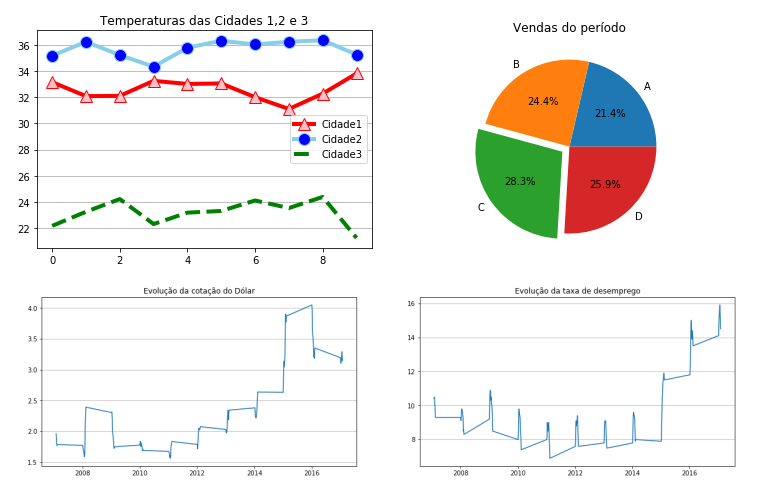

# Your Datascience, Machine Learning and AI Hub
[*Cleuton Sampaio*](https://github.com/cleuton)

## Data visualization mini-course with Python

This mini course will teach you how to create Python visualizations for data Science jobs, using simple resources. Each lesson will address a topic. Check it out:

# 1 - Turbo introduction to charts

In this lesson we will see the basic part of generating charts, with formatting and positioning of the most common charts.

See [**HERE**](./data_visualization_python_english.ipynb) the Jupyter Notebook.

# 2 - Data visualizations with more than 2 dimensions: 

In this lesson, we'll look at how to provide visualizations with more than two dimensions of data.

See [**HERE**](./data_visualization_python_2_english.ipynb) the Jupyter Notebook.