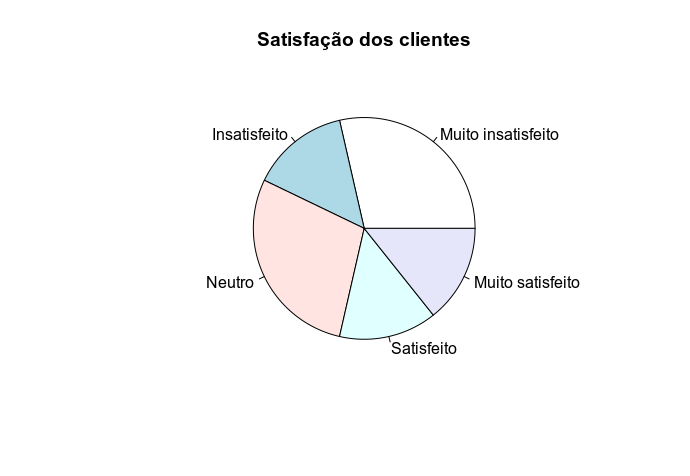
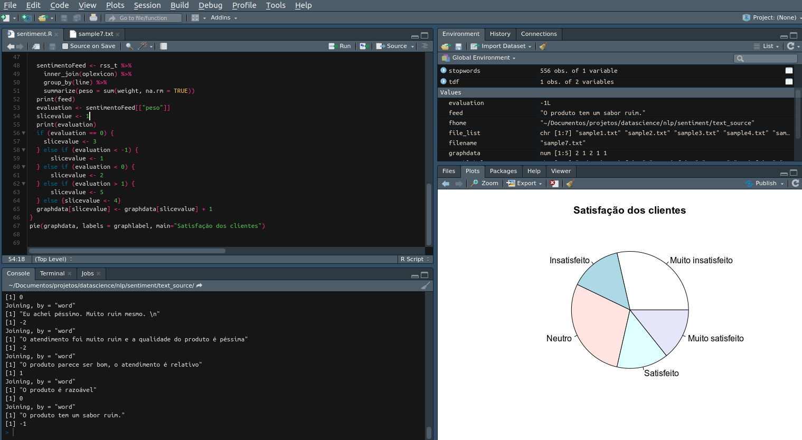

# ANÁLISE DE SENTIMENTOS DE TEXTOS EM PORTUGUÊS



[*Cleuton Sampaio*, Outubro de 2019](https://github.com/cleuton)

[**ENGLISH VERSION**](./english.md)

Toda empresa tem um canal de atendimento ao cliente, certo? Pode ser um endereço de *email*, ou um formulário no qual o cliente registra sua mensagem. 

É muito difícil analisar quantitativamente as mensagens, sendo um trabalho tedioso e que requer muitas horas de leitura e interpretação. 

Uma maneira de facilitar este trabalho é classificar as mensagens mais prioritárias, o que pode ser feito de duas maneiras: 
1. Presença de certos termos no corpo da mensagem;
2. Análise de sentimento dos textos e priorização.

Este programa lê os arquivos contidos em uma pasta e classifica as mensagens de acordo com o sentimento do texto utilizando técnicas de [NLP](https://pt.wikipedia.org/wiki/Processamento_de_linguagem_natural).

Análise de sentimentos é um dos segmentos de **NLP** (Natural Language Processing), e tem um grande apelo. Podemos interpretar o sentimento dos textos e, consequentemente, o sentimento de quem os escreveu. Há vários usos para isto, como: CRM, por exemplo. 

Este Demo usa um arquivo léxico do OpLexicon, da PUCRS: 

Souza, M.; Vieira, R. Sentiment Analysis on Twitter Data for Portuguese Language. 10th International Conference Computational Processing of the Portuguese Language, 2012. [pdf] [bib]

Souza, M.; Vieira, R.; Busetti, D.; Chishman, R. e Alves, I. M. Construction of a Portuguese Opinion Lexicon from multiple resources. 8th Brazilian Symposium in Information and Human Language Technology, 2011. [pdf] [bib]

[http://ontolp.inf.pucrs.br/Recursos/downloads-OpLexicon.php](http://ontolp.inf.pucrs.br/Recursos/downloads-OpLexicon.php)

## Instalação

É um programa feito em **R**, portanto, você precisa [*instalar a linguagem*](http://leg.ufpr.br/~fernandomayer/aulas/ce083-2016-2/R-instalacao.html). Se quiser, pode instalar o [**Rstudio**](https://www.vivaolinux.com.br/dica/Instalando-o-R-e-Rstudio-no-Ubuntu) também. Estou usando Linux - Ubuntu, portanto, fornecerei as instruções para este sistema operacional, mas pode ser instalado e rodar em qualquer plataforma. 

Neste exemplo, eu uso algumas bibliotecas de terceiros e que precisam ser instaladas: 
- [**readr**](https://cran.r-project.org/web/packages/readr/index.html)
- [**dplyr**](https://cran.r-project.org/web/packages/dplyr/vignettes/dplyr.html)
- [**stringr**](https://cran.r-project.org/web/packages/stringr/vignettes/stringr.html)
- [**tidytext**](https://cran.r-project.org/web/packages/tidytext/vignettes/tidytext.html)

A preparação de um ambiente **R** não é muito simples. Eu recomendo que instale o [**Anaconda**](https://www.anaconda.com/) e crie um ambiente **R**, instalando os pacotes nele. 

Para começar, temos que instalar algumas coisas no sistema operacional: 

```
sudo apt-get install -y r-cran-isocodes
sudo apt install libxml2-dev
conda install -c r r-xml2
sudo apt-get install libgdal-dev
```
Depois, podemos iniciar o **R** (ou o **Rstudio**) e instalar os pacotes restantes lá mesmo: 

```
install.packages(c("dplyr", "readr", "stringr", "tidyRSS", "tidytext", "wordcloud"))
install.packages(c("mnormt", "psych", "SnowballC", "hunspell", 
                   "broom", "tokenizers", "janeaustenr"))
install.packages('stopwords')
```

Finalmente, temos que criar duas variáveis de ambiente: 
- **SENTIMENT_HOME**: A pasta onde está o script e o arquivo léxico;
- **SENTIMENT_TEXT**: A pasta onde estão os arquivos que você quer analisar;

Se estiver rodando via **terminal**: 
```
export SENTIMENT_HOME=...
export SENTIMENT_TEXT=...
```

Se estiver rodando dentro do **Rstudio**: 
```
Sys.setenv(SENTIMENT_HOME = "...")
Sys.setenv(SENTIMENT_TEXT = "...")
```

Neste pacote, inclui algumas amostras de texto a serem analisadas, dentro da pasta **text_source**. 

É só clonar o repositório!

## Resultados

Com os arquivos de teste, os resultados são estes: 

```
Joining, by = "word"
[1] "Eu achei ótimo esse produto! Sensacional!\n"
# A tibble: 1 x 2
   line  peso
  <int> <int>
1     1     2
Joining, by = "word"
[1] "Realmente, é um bom produto, porém, eu acho um pouco caro.\n"
# A tibble: 1 x 2
   line  peso
  <int> <int>
1     1     0
Joining, by = "word"
[1] "Eu achei péssimo. Muito ruim mesmo. \n"
# A tibble: 1 x 2
   line  peso
  <int> <int>
1     1    -2
```

Quanto mais positiva a avaliação, maior o sentimento positivo da mensagem, e vice-versa. Uma mensagem com avaliação zero é neutra. 

Veja a execução completa no **Rstudio**:



*Cleuton Sampaio, M.Sc.*
