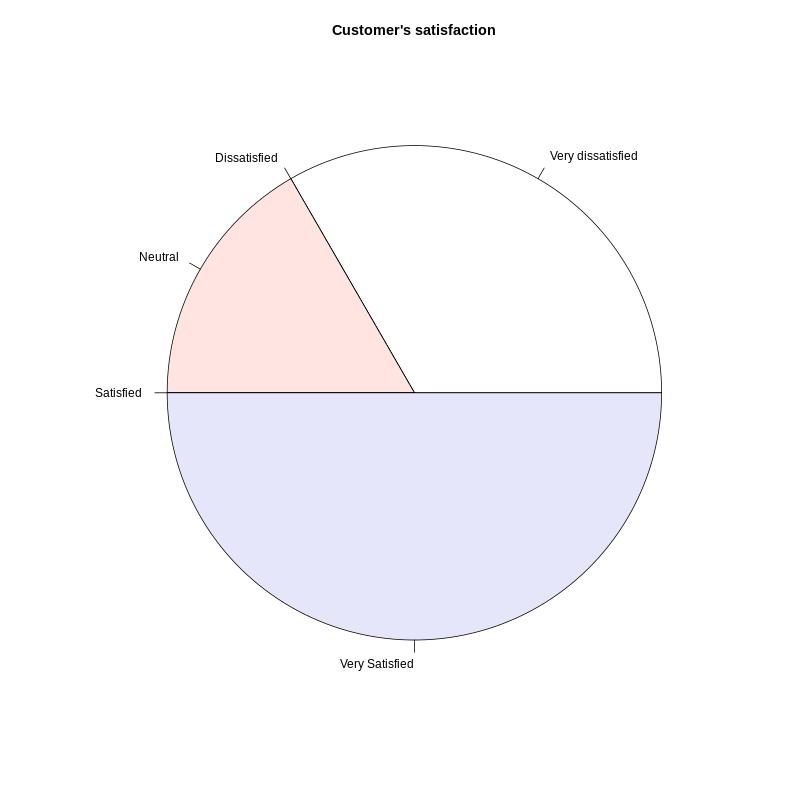

# Naive sentiment analysis using R



[*Cleuton Sampaio*, October 2019](https://github.com/cleuton)

Every company has a customer service channel, right? It can be an *email* address, or a form in which the customer registers his message.

It is very difficult to quantitatively analyze messages, being a tedious job that requires many hours of reading and interpretation.

One way to facilitate this work is to classify the highest priority messages, which can be done in two ways:
1. Presence of certain terms in the message body;
2. Sentiment analysis of texts and prioritization.

This program reads the files contained in a folder and classifies the messages according to the feeling of the text using techniques of [**NLP**](https://en.wikipedia.org/wiki/Natural_language_processing) in the **R** language.

Sentiment analysis is one of the segments of **NLP** (Natural Language Processing), and has great appeal. We can interpret the feeling of the texts and, consequently, the feeling of those who wrote them. There are several uses for this, such as: CRM, for example.

This Demo uses the [**AFINN lexicon file**](http://www2.imm.dtu.dk/pubdb/views/publication_details.php?id=6010) to calculate the weight of a text, based on a -5,+5 interval. 

## Installation

It is a program made in **R**, therefore, you need to [*install the R interpreter*](https://www.datacamp.com/community/tutorials/installing-R-windows-mac-ubuntu). If you want, you can install [**Rstudio**](https://rstudio.com/products/rstudio/download/) as well. I am using Linux - Ubuntu, so I will provide instructions for this operating system, but it can be installed and run on any platform.

In this example, I use some third-party libraries that need to be installed:
- [**readr**] (https://cran.r-project.org/web/packages/readr/index.html)
- [**dplyr**] (https://cran.r-project.org/web/packages/dplyr/vignettes/dplyr.html)
- [**stringr**] (https://cran.r-project.org/web/packages/stringr/vignettes/stringr.html)
- [**tidytext**] (https://cran.r-project.org/web/packages/tidytext/vignettes/tidytext.html)

Setting up an **R** environment is not very simple. I recommend that you install [**Anaconda**](https://www.anaconda.com/) and create a **R** environment by installing packages on it.

To begin, we have to install a few things in the operating system:

```
sudo apt-get install -y r-cran-isocodes
sudo apt install libxml2-dev
conda install -c r r-xml2
sudo apt-get install libgdal-dev
```
Then, we can start **R** (or **Rstudio**) and install the remaining packages right there:

```
install.packages(c("dplyr", "readr", "stringr", "tidyRSS", "tidytext", "wordcloud"))
install.packages(c("mnormt", "psych", "SnowballC", "hunspell", 
                   "broom", "tokenizers", "janeaustenr"))
install.packages('stopwords')
```
Finally, we have to create two environment variables:
- **SENTIMENT_HOME**: The folder where the script and the lexical file are;
- **SENTIMENT_TEXT_ENGLISH**: The folder where the files you want to analyze are located;

In this package, i've included some text samples to be analyzed, inside the **english_samples** folder.

Run the [R script](./sentiment_english.R): 
```
Rscript sentiment_english.R
```

Just clone this repo!

## Results

This is the result using the samples: 

```
Joining, by = "word"
[1] "The product is regular"
[1] 3
Joining, by = "word"
[1] "This product is garbage and should not be sold!"
[1] 1
Joining, by = "word"
[1] "You know... the product is not so bad..."
[1] 1
Joining, by = "word"
[1] "It's a good product, and with some improvements can be a great product!"
[1] 5
Joining, by = "word"
[1] "It's a good product."
[1] 5
Joining, by = "word"
[1] "It's easy to use and very nice. I love it!"
[1] 5
```

And this is the graph: 


## Why naive?

Good question! Because this algorithm is less than perfect and can give you false negatives and positives! 

People often use **sarcasm**, **double negatives**, and other indirect expressions to refer to a product. For example, the [**sample3** file](./english_samples/sample3.txt) can mislead you: 

```
You know... the product is not so bad...
```

This algorithm extracts english [**stop words**](https://en.wikipedia.org/wiki/Stop_words), then it uses the [**lexicon** file](./AFINN-111.csv) to assign **weights** to each word, summing the result. Negative words can cancel positive ones. It is a **naive** algorithm. 

Although naive, this algorithm can still give good results, if used as the first filter of messages, decreasing the amount of messages to be analyzed in detail.

A better solution would consider the influence of one word over another, like the [**LTSM** deep learning soltions](https://en.wikipedia.org/wiki/Long_short-term_memory). In fact, there are some good tutorials, like this one: https://towardsdatascience.com/sentiment-analysis-using-lstm-step-by-step-50d074f09948.

But they all use complicated frameworks, and require large CPU's or even GPU's to process. 

This is a simple solution that runs using low resources, and is very fast. 


