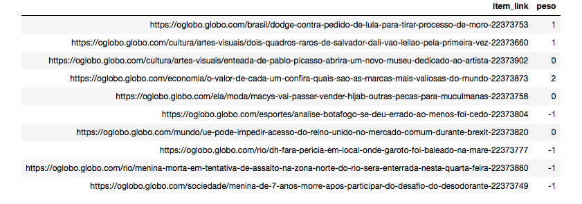

# Análise de sentimentos de Feeds em Português

Análise de sentimentos é um dos segmentos de NLP (Natural Language Processing), e tem um grande apelo. Podemos interpretar o sentimento dos textos e, consequentemente, o sentimento de quem os escreveu. Há vários usos para isto, como: CRM, por exemplo. 

Este Demo usa um arquivo léxico do OpLexicon, da PUCRS: 

Souza, M.; Vieira, R. Sentiment Analysis on Twitter Data for Portuguese Language. 10th International Conference Computational Processing of the Portuguese Language, 2012. [pdf] [bib]

Souza, M.; Vieira, R.; Busetti, D.; Chishman, R. e Alves, I. M. Construction of a Portuguese Opinion Lexicon from multiple resources. 8th Brazilian Symposium in Information and Human Language Technology, 2011. [pdf] [bib]

[http://ontolp.inf.pucrs.br/Recursos/downloads-OpLexicon.php](http://ontolp.inf.pucrs.br/Recursos/downloads-OpLexicon.php)

# Instalação

Veja as [**instruções de instalação**](../tagCloud/README.md).

Depois de instalar o Anaconda e criar o ambiente instale os pacotes que estão dentro de r-packages.txt.

# Execução

Ao executar o script R [analiseSentimento.R](./analiseSentimento.R) ou o [notebook: Análise_Sentimento_Feed.ipynb](./Análise_Sentimento_Feed.ipynb), você verá o resultado: 



Escolha o feed (ou os feeds) que desejar e altere no código R: 
```
feed <- tidyfeed("https://oglobo.globo.com/rss.xml?completo=true")
```

# Funcionamento

Primeiro, carregamos o arquivo com o dicionário léxico OpLexicon: 
```
oplexicon <- read_csv('oplexicon_v3.0/lexico_v3.0.txt', col_names = c('word', 'type', 'weight', 'other'), col_types = 
                        cols(
                          word = col_character(),
                          type = col_character(),
                          weight = col_integer(), 
                          other = col_character()
                        ))
head(oplexicon)
```

Em segundo lugar, eu carrego um arquivo de "stopwords" em Português, pois não quero analisar sentimento de artigos e preposições, por exemplo: 

```
stopwords <- read_csv('portuguese-stopwords.txt', col_names = 'word')
```

Depois, eu transformo o arquivo de feed em formato [**Tidy**](https://d-van.org/como-formatar-seu-banco-de-dados-para-análise-tidy-data-d85b8fbe428e). E executo um "anti-join" com o arquivo de *stopwords*, para remover as conjunções, preposições, artigos etc: 

```
rss_t <- feed %>%
  unnest_tokens(word,item_title) %>%
  anti_join(stopwords,by="word") 
```

Finalmente, é uma questão de fazer um "inner join" com o arquivo léxico e somar o peso dos sentimentos, agrupando por link de notícia:

```
sentimentoFeed <- rss_t %>%
  inner_join(oplexicon) %>%
  group_by(item_link) %>%
  summarize(peso = sum(weight, na.rm = TRUE))
print(sentimentoFeed)
```

O sentimento pode ser positivo (> 0), negativo (< 0) ou neutro (= 0).